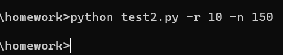
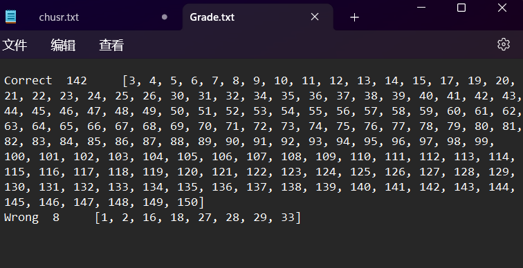

# Expression_Generate
| 软件工程 |https://edu.cnblogs.com/campus/gdgy/CSGrade21-12|
|---------|------------------------------------------------|
| 作业要求|https://edu.cnblogs.com/campus/gdgy/CSGrade21-12/homework/13016|
| 作业目标 |个人项目|

github链接 ： https://github.com/FHTHomeworkAtgdut/Expression_Generate

## 作业成员信息
|作业成员|学号|
|-------|----|
|冯浩天|3121004779|
|朱正东|3121004806|

## PSP表：
| PSP                                     | Personal Software Process Stages | 预估耗时（分钟） | 实际耗时（分钟） |
| --------------------------------------- | -------------------------------- | -------- | -------- |
| Planning                                | 计划                               | 30      | 45      |
|  Estimate                              | 估计这个任务需要多少时间                   | 360      | 450      |
| Development                             | 开发                               | 300      | 300      |
| Analysis                              |  需求分析 (包括学习新技术)                 | 120      | 180      |
|  Design Spec                           |  生成设计文档                         | 30       | 10       |
|  Design Review                         |  设计复审                           | 30       | 10       |
|  Coding Standard                       |  代码规范 (为目前的开发制定合适的规范)           | 10       | 5        |
|  Design                                |  具体设计                           | 10       | 5        |
|  Coding                                |  具体编码                           | 150      | 150      |
|  Code Review                           |  代码复审                           | 20       | 10        |
|  Test                                  |  测试（自我测试，修改代码，提交修改）             | 40       | 40       |
| Reporting                               | 报告                               | 30       | 25       |
|  Test Repor                            |  测试报告                           | 20       | 10       |
|  Size Measurement                      |  计算工作量                          | 5        | 5        |
|  Postmortem & Process Improvement Plan |  事后总结, 并提出过程改进计划                | 5        | 5        |
| Total                                   | 总计                               | 1120     |  1225     |


## 功能解析：

### 大致流程：


### 代码解析：

为了便于生成与计算表达式，用二叉树结构存储表达式:

```python
class TreeNode:
    def __init__(self, val):
        self.val = val
        self.left = None
        self.right = None
```

生成表达式中的数字，按一定概率生成指定范围内的分数或整数：
```py
def generate_num():
    if random.random() < 0.75:
        return  random.randint(1, max_num)
    else:
        return Fraction(random.randint(1, max_num),random.randint(1, max_num))
```

根据指定的深度创建表达式，这里的depth为2，就会至多生成3个表达式,而且进行了初步的滤去负数以及除法中分母为0的情况
不过有个缺点，无法生成形如a+(b+c)+d的算式,~~不嫌麻烦的话可以专门写个函数去生成括号在这个位置的表达式~~
```py
def generate_expression(depth):
    if depth == 0 or random.random() < 0.3 and depth != max_depth:
        # 当达到指定深度时， 避免出现 x = x 的情况
        num = generate_num()
        return TreeNode(num)
    else:
        operator = random.choice(operator_list)
        node = TreeNode(operator)
        node.left = generate_expression(depth - 1)
        node.right = generate_expression(depth - 1)
        if type(node.left.val) != str and type(node.right.val)!= str:
            if node.left.val - node.right.val <= 0 and node.val == '-':
                while node.left.val - node.right.val <= 0:
                    node.left.val = generate_num()
                    node.right.val = generate_num()
        return node
```

利用二叉树同构判定是否有重复算式
```py
def is_repeated(p,q):
    if p == q:
        return True
    if p.val == q.val:
        return (is_repeated(p.left,q.left) and is_repeated(p.right,q.right)) or (is_repeated(p.right,q.left) and is_repeated(p.left,q.right))
    else:
        return False;
```

生成表达式字符串：
```py
def expression_string(root,root_bracket): # 整条式子外部不需要括号
    if root is None:
        return ""

    if root.left is None and root.right is None:
        return str(root.val)
    else:
        left_expr = expression_string(root.left,root_bracket)
        right_expr = expression_string(root.right,root_bracket)
        operator = root.val

        if operator in "+-" and root_bracket != root:
            return f"({left_expr} {operator} {right_expr})"
        else:
            return f"{left_expr} {operator} {right_expr}"
```


计算表达式：
```py
def calculate_expression(root):
    if root is None:
        return Fraction(0)

    if root.left is None and root.right is None:
        return root.val
    else:
        left_value = calculate_expression(root.left)
        right_value = calculate_expression(root.right)
        operator = root.val

        if operator == '+':
            return left_value + right_value
        elif operator == '-':
            return left_value - right_value
        elif operator == '*':
            return left_value * right_value
        elif operator == '/':
            return Fraction(left_value,right_value)
```

主函数中通过argparse获取命令行参数
```py
        parser = argparse.ArgumentParser()
        parser.add_argument('-r',"--range", type=int,default=10)
        parser.add_argument('-n',"--num" ,type=int,default=1000)
        parser.add_argument('-e',"--exercise", type=str,default="exercise.txt")
        parser.add_argument('-a',"--answer", type=str,default="answer.txt")
        args = parser.parse_args()
```

## 结果演示：
命令行输入：



输出的文件:


将待检查的答案文件命名为test.txt,将正确的答案改错：


命令行输入与输出：


grade文件：


## 性能分析

验证表达式是否重复的函数性能占比非常高，这是由于当前表达式要与之前的所有表达式做验证所导致，此外将二叉树转为字符串（树的中序遍历）耗时也比较高

## 测试
~~施工中~~

## 小结：
1. 有些写法比较冗余与随意
2. 有些数字不是很合理，比如分数会出现4位数的分母
3. 结对工作时的分工和相互检查的意识需要加强，效率需要提高